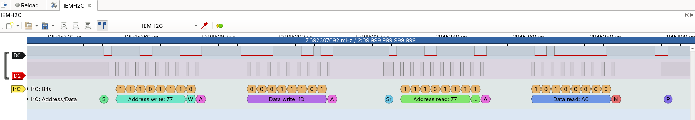
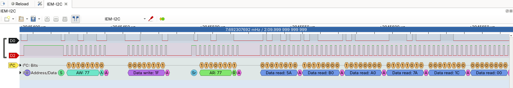
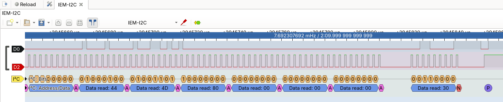

# IoT Environmental Monitor

IoT device that periodically collects temperature, pressure, and humidity from a Bosch BME688 over I2C and publishes it in various topics via MQTT 3.1.1 over Wi-Fi.

## Build

```bash
 west build -b esp32c6_devkitc/esp32c6/hpcore -- -DDTC_OVERLAY_FILE=boards/esp32c6_devkitc.overlay
```

## Serial Logs

```log
[00:00:15.064,000] <inf> net_dhcpv4: Received: 10.42.60.126
[00:00:15.064,000] <inf> iem_network: IPv4 address added.
[00:00:15.065,000] <inf> iem_network: WiFi connection established.
[00:00:15.065,000] <inf> iem_mqtt_client: Connecting to MQTT broker 10.42.20.125:1883...
[00:00:15.091,000] <inf> net_mqtt: Connect completed
[00:00:15.103,000] <inf> iem_mqtt_client: MQTT connected to broker.
[00:00:15.103,000] <inf> iem_mqtt_client: MQTT ready (attempt 1).
[00:01:00.015,000] <inf> iem_sensor: Sensor reading: Temperature: 23749 m°C, Pressure: 99226 mPa, Humidity: 23611 m%RH
[00:01:00.019,000] <dbg> iem_mqtt_client: publish_to_topic: sensors/temperature: 23.749.
[00:01:00.019,000] <dbg> iem_mqtt_client: publish_to_topic: sensors/humidity: 23.611.
[00:01:00.019,000] <dbg> iem_mqtt_client: publish_to_topic: sensors/pressure: 99.226.
[00:02:00.019,000] <inf> iem_sensor: Sensor reading: Temperature: 22629 m°C, Pressure: 99237 mPa, Humidity: 23456 m%RH
[00:02:00.023,000] <dbg> iem_mqtt_client: publish_to_topic: sensors/temperature: 22.629.
[00:02:00.023,000] <dbg> iem_mqtt_client: publish_to_topic: sensors/humidity: 23.456.
[00:02:00.023,000] <dbg> iem_mqtt_client: publish_to_topic: sensors/pressure: 99.237.
```

## I2C Communication


**PulseView capture:** ESP32 reading the `meas_status_0` register (0x1D) BME688.


**PulseView capture:** ESP32 receiving raw temperature, humidity, and pressure measurements from the BME688 (1).

\
**PulseView capture:** ESP32 receiving raw temperature, humidity, and pressure measurements from the BME688 (2).